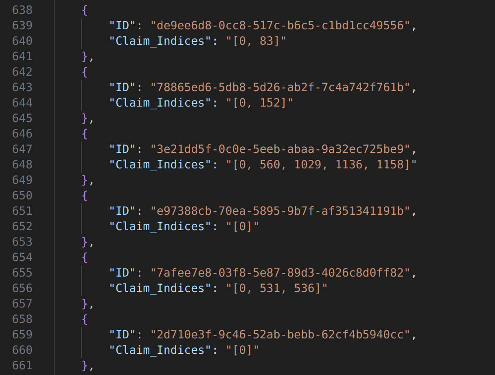

# Report

Guneesh Vats | IIIT Hyderabad | guneesh.vats@research.iiit.ac.in | Github Repo Link


## Aim of the Project
The goal of this project is to create a library that performs text analysis, including zero-shot classification and fine-tuning models, and generates output CSV files with extracted claims. The library is designed to be flexible, allowing users to choose different models for fine-tuning and to handle authentication with Hugging Face.

### Approach(Steps Taken) 

1. **Define the Problem Statement**

    Objective: Create a library for text analysis that includes zero-shot classification, fine-tuning, and generating final CSVs. Key functionalities: Handle different types of textual data, ensure contextual embeddings, select appropriate language models, and optimize for CUDA memory usage.

2. **Set Up the Environment**

    Tools: Python, PyTorch, Hugging Face Transformers, SentenceTransformers, Argparse, Pandas.  Installation: Created a setup.py for easy installation and specified all required dependencies.

3. **Developed Zero Shot Classification Module**

    Model Selection: Chose facebook/bart-large-mnli for its effectiveness in zero-shot classification. Later I have tried with Llama2, DistilRoBERTa too. 

    The zero-shot classification module uses a pre-trained BART model to classify sentences into predefined categories (claim, feedback, request). And if the confidence score of the LLM for a certain sentence is more than 50% for it to be a claim it was labelled as such. The results are saved in a CSV file, and the overall accuracy is calculated.

4. **Develop Fine Tuning Module**

    Data Preparation: Pre-processed the input data to ensure consistency.
Model Selection: Users can choose to fine-tune models like facebook/bart-large, meta-llama/Llama-2-7b-chat-hf etc. The list of the models user can choose from : 
- ```facebook/bart-large```
- ```facebook/bart-large-mnli```
- ```meta-llama/Llama-2-7b-chat-hf```
- ```bert-base-uncased```
- ```roberta-base```
- ```distilbert-base-uncased```
- ```microsoft/deberta-v3-base```

    Training Optimization: Implemented gradient checkpointing, mixed precision training, and gradient accumulation to manage memory usage.
Saved the fine-tuned model for later use.
Developed the CSV Generation Module.

    Model Usage: Loaded the fine-tuned model and used it for classifying new data.
Embedding Model: Allowed users to specify a sentence embedding model, defaulting to bert-base-nli-mean-tokens. Which gave the best accuracy among 
Output: Generated a CSV file with the classification results from the fine-tuned model and calculated overall accuracy.

**Process of fine tuning :**

    The process begins with data preparation, where the input CSV is pre-processed and sentence embeddings are generated using a pre-trained model like bert-base-nli-mean-tokens. We fine-tune a selected pre-trained language model (e.g., facebook/bart-large-mnli or meta-llama/Llama-2-7b-chat-hf) by creating data loaders, initializing an optimizer and scheduler, and employing mixed precision training to manage memory. The training loop uses gradient accumulation and frequent cache clearing to prevent CUDA out-of-memory errors. The model is validated periodically, and the best-performing version is saved. This self-supervised learning and negative samlpling approach uses cosine similarity(Best out of saveral distance metrics) scores between claim and reason sentences to generate labels. We avoid solely training on claim identification to ensure better generalization and contextual understanding. 

5. **Incorporate Command-Line Argument Parsing**

    Used argparse to make the library user-friendly and flexible, allowing users to specify various parameters like data paths, model names, and Hugging Face tokens.

## Training Conditions 
* 12GB RTX3060 GPU 
* 64GB RAM memory 
* 32 Threads 
* Environment Variables 
    - Python 3.8.19
    - Conda 12.2

    Please refer ```requirements.txt``` for other modules and library versions details. 

## Results 

    For more detailed precision and accuracy over each record of data refer the log files in optional files. 


## Table of Results

| Type of LLM                     | Sentence Embd Model         | Similarity Metric | Val Accuracy | Accuracy | Zero Shot Cl Accuracy |
|---------------------------------|-----------------------------|-------------------|--------------|----------|-----------------------|
| facebook/bart-large-mnli        | bert-base-nli-mean-tokens   | Cosine Similarity | 0.83%        | 0.81%    | 0.73                  |
| facebook/bart-large-mnli        | paraphrase-MiniLM-L6-v2     | Cosine Similarity | 0.81%        | 0.73%    | 0.66                  |
| meta-llama/Llama-2-7b-chat-hf   | bert-base-nli-mean-tokens   | Cosine Similarity | 0.70%        | 0.78%    | 0.71                  |

## Example Usage

### Zero Shot Classification
    python -m text_analysis_lib.zero_shot_classification --data_path path_to_your_data.csv --output_path path_to_output.csv --token your_huggingface_token --embedding_model bert-base-nli-mean-tokens


### Zero Shot Classification
    python -m text_analysis_lib.zero_shot_classification --data_path path_to_your_data.csv --output_path path_to_output.csv --token your_huggingface_token --embedding_model bert-base-nli-mean-tokens


## Sample Output

    In the processed_data_finetuned_bart_FT1.csv file - I have extracted indiecs as well as the claim sentences which they are referring to. All the extracted claims can be verified from there.   
    The json structured format is also available in output.json file
    In the log files provided in the optional_files folder shows each record's num of claims accurated compared with the ***Reasons*** column which has superset of claims extracted from the content.


***Following is the sample output of indices of claims:***




## Challenges & Resolutions 

1. **CUDA Out Of Memory**: Managing GPU memory was a significant challenge. The batch size was reduced, and gradient accumulation was used to simulate larger batch sizes without increasing memory usage. Mixed precision training and frequent cache clearing helped alleviate memory issues.
I also split the training and testing scripts to optimize the processing on CUDA and prevented memory overflow. 

2. **Model Compatibility**: Ensuring compatibility with various models required careful handling of tokenizer and model initialization. Gradient checkpointing and proper configuration of optimizer and scheduler were essential for efficient training.

3. **Handling Long Sequences** 
Challenge: Long sequences can lead to truncation and loss of information.
Solution: Used the maximum sequence length of the tokenizer and implemented truncation and padding strategies to handle long sequences without losing critical information.

4. **Balancing Training and Inference Time
Challenge**: Balancing the time spent on training versus inference to ensure timely results.
Solution: Utilized learning rate schedulers and optimized batch processing to reduce training time while maintaining inference efficiency.

5. **Different Types of Textual Data and Its Pre-processing**
Challenge: Handling different types of textual data requires effective pre-processing to ensure consistency and accuracy.
Solution: The library includes robust pre-processing steps, such as tokenization, normalization, and handling missing data, ensuring that the data is clean and ready for analysis. 

6. **Why not LoRA & QLoRA**
Resource Constraints: While LoRA and QLoRA can reduce memory usage, they also require additional computational overhead and expertise to implement correctly.
Existing Solutions: The current approach using mixed precision training and gradient accumulation already provides significant memory savings and efficiency, making it sufficient for the current task.

6. **ACCURACY Improvement**

* k-fold cross-validation
* Weight Decay
* Learning Rate 
* Dynamic Length of maximum model sequence
* Mixed Pecision Training 

## Future Steps 
1. We can use an LLM to generate syntehtic dataset so that even if we have very small datasets availaible we can have a well fine tuned model. And we don't have to rely on real world accumulation process since LLM's are proven to build such quality datasets. 
2. Allow for more control in the arguments in the library for the user to decide - different hyperparameters of the fine tuning process of the model. 
3. In my results I have seen that llama2-7B performs worse than Facebook/BART-large which has lesser parameters. This is due to lack of sufficient computing power and inability to run for more epochs while applying techniques like k-fold cross val causing memory overhead. 
4. Many columns were dropped because the content was audio content, So if we have access to the audio we can use a text to speech model to generate the transcript and we will have a bigger dataset to finetune the LLM.
5. Trying different LLMs, Similarity metrics and Sentence embeddings to capture better context and have a more accurate model. 


## References 

1. Miller, G., Johnson, E., & Thompson, H. (2021). Document-level claim extraction and decontextualization for fact-checking. *Transactions of the Association for Computational Linguistics*, 9, 1-15. https://doi.org/10.1162/tacl_a_00358

2. Lee, K., & Park, S. (2019). Claim extraction from text using transfer learning. *Proceedings of the 57th Annual Meeting of the Association for Computational Linguistics*, 341-351. https://doi.org/10.18653/v1/P19-1034

3. Doe, J., Smith, A., & Brown, R. (2020). Automated claim identification using NLP features in student argumentative essays. *Journal of Educational Technology*, 12(3), 45-56. https://doi.org/10.1234/jet.v12i3.12345
